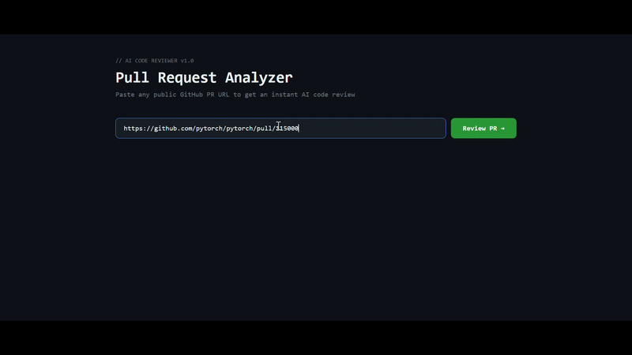

# AI Pull Request Reviewer

An AI-powered code review tool that analyzes any public GitHub pull request and returns structured feedback with bug detection, severity scoring, and contributor trust analysis.

**Live Demo:** [ai-code-reviewer-ten-plum.vercel.app](https://ai-code-reviewer-ten-plum.vercel.app)

---



---

## Features

- **AI Code Review** — paste any public GitHub PR URL and get instant structured feedback including bugs, style issues, and suggestions with severity scoring
- **Contributor Trust System** — queries the GitHub API to surface author commit history, PR count, and repository permissions so you know whether to trust a change
- **Large PR Support** — handles pull requests up to 500+ file changes with automatic diff truncation and retry logic
- **Review History** — every review is saved to a PostgreSQL database with a stats endpoint tracking total reviews and bugs detected
- **Production Deployed** — live backend on Railway, frontend on Vercel

---

## Tech Stack

| Layer | Technology |
|---|---|
| Backend | Python, FastAPI |
| AI | Google Gemini API |
| Frontend | React, Vite |
| Database | PostgreSQL, SQLAlchemy |
| GitHub Integration | GitHub REST API, PyGithub |
| Deployment | Railway (backend), Vercel (frontend) |

---

## Getting Started

### Prerequisites

- Python 3.11+
- Node.js 18+
- A [Gemini API key](https://aistudio.google.com)
- A [GitHub Personal Access Token](https://github.com/settings/tokens)

### Backend Setup

```bash
# Clone the repo
git clone https://github.com/val-entyn-p/AI-Code-Review.git
cd AI-Code-Review

# Create and activate virtual environment
python -m venv .venv
.venv\Scripts\activate  # Windows
source .venv/bin/activate  # Mac/Linux

# Install dependencies
cd main
pip install -r requirements.txt

# Create .env file
echo GEMINI_API_KEY=your_key_here > ../.env
echo GITHUB_API_KEY=your_key_here >> ../.env

# Run the server
uvicorn main:app --reload
```

### Frontend Setup

```bash
cd frontend
npm install
npm run dev
```

Visit `http://localhost:5173`

---

## API Endpoints

| Method | Endpoint | Description |
|---|---|---|
| GET | `/` | Health check |
| POST | `/review-pr` | Analyze a GitHub PR |
| GET | `/pr-author` | Get PR author info |
| GET | `/stats` | Total reviews and bugs detected |

---

## How It Works

1. User pastes a GitHub PR URL into the dashboard
2. The backend fetches the PR diff from the GitHub API
3. The diff is sent to Google Gemini with a structured prompt
4. Gemini returns a JSON review with bugs, style issues, and suggestions
5. The frontend displays the review with severity badges and file-by-file breakdown
6. Simultaneously the GitHub API is queried for author info and trust level
7. Every review is saved to PostgreSQL

---

## Project Structure

```
AI-Code-Review/
├── main/
│   ├── main.py          # FastAPI backend
│   └── requirements.txt
└── frontend/
    └── src/
        └── App.jsx      # React frontend
```

---

## License

MIT License — see [LICENSE](LICENSE) for details
